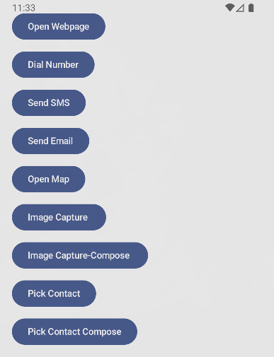
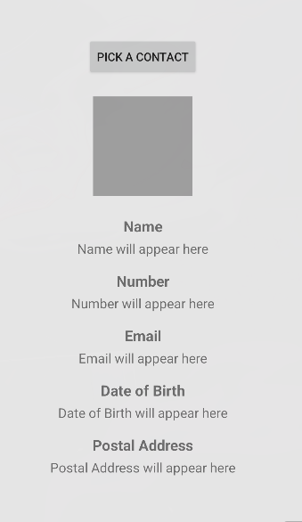
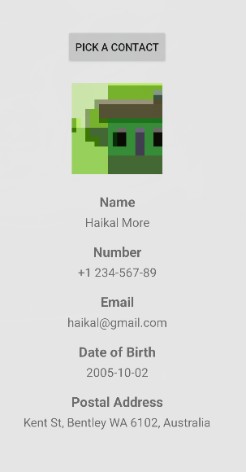

# App-to-App Interaction Workshop: Contact Picker

## Project Overview

This Android application demonstrates various app-to-app interaction techniques with a focus on contact picking functionality. The project showcases both traditional XML-based UI and modern Jetpack Compose implementations, providing a comprehensive learning experience for Android developers.

### Main Screen
| Description |
|------------|
| Main application screen showing all available app-to-app interaction options, including both XML and Compose contact picker implementations |
|  |

### Contact Picker
| Initial state | Populated state |
|---|---|
|  |  |


### Architecture Overview

The project implements two parallel approaches for the contact picker functionality:

1. **XML-based Implementation** (`PickContact.kt` + `activity_pick_contact.xml`)
   - Traditional Android UI approach using XML layouts
   - Imperative UI programming with findViewById and view manipulation

2. **Jetpack Compose Implementation** (`PickContactCompose.kt`)
   - Modern declarative UI approach
   - State-driven UI with Compose functions and state management

### Dependencies Used

The project relies on the following key dependencies:

```kotlin
// Core Android libraries
implementation(libs.androidx.core.ktx)
implementation(libs.androidx.lifecycle.runtime.ktx)
implementation(libs.androidx.activity.compose)

// Jetpack Compose
implementation(platform(libs.androidx.compose.bom))
implementation(libs.androidx.ui)
implementation(libs.androidx.ui.graphics)
implementation(libs.androidx.ui.tooling.preview)
implementation(libs.androidx.material3)

// Traditional Android UI
implementation(libs.androidx.appcompat)
implementation(libs.material)
implementation(libs.androidx.activity)
implementation(libs.androidx.constraintlayout)
```

### Key Components and Their Purposes

1. **ContactDetails.kt**
   - Data class that encapsulates all contact information
   - Includes fields for name, phone number, email, date of birth, postal address, and contact image
   - Supports both URI string and Bitmap representations of contact photos

2. **PickContact.kt**
   - XML-based implementation of the contact picker
   - Uses Activity Result APIs for permission handling and contact picking
   - Implements comprehensive contact data retrieval from the Contacts Provider

3. **PickContactCompose.kt**
   - Jetpack Compose implementation of the contact picker
   - Uses rememberLauncherForActivityResult for permissions and contact picking
   - Features state-driven UI with reactive updates

4. **MainActivity.kt**
   - Main entry point of the application
   - Provides navigation to all app-to-app interaction examples
   - Includes buttons for both XML and Compose contact picker implementations

### Data Models

#### ContactDetails Class

```kotlin
data class ContactDetails(
    val name: String?,
    val phoneNumber: String?,
    val email: String?,
    val dateOfBirth: String?,
    val postalAddress: String?,
    val contactImageUri: String?,
    val contactImageBitmap: Bitmap? = null
)
```

This data class serves as a unified model for holding all contact information retrieved from the device's contacts database.

## Features Implemented

### Basic Contact Picking
- **Name Retrieval**: Extracts the display name from the contacts database
- **Phone Number Retrieval**: Fetches the primary phone number associated with the contact

### Enhanced Contact Details
- **Email Address**: Retrieves the primary email address from the contact
- **Date of Birth**: Extracts birthday information from the contact's events
- **Postal Address**: Fetches the formatted postal address from structured postal data
- **Contact Image**: Retrieves and displays the contact's photo as a Bitmap

### Dual UI Implementation
- **XML Layout**: Traditional approach with separate layout file and view binding
- **Jetpack Compose**: Modern declarative UI with state management and composable functions

### Prerequisites
- Android Studio Hedgehog | 2023.1.1 or later
- Android SDK API 24 (Android 7.0) or higher
- Kotlin support in Android Studio

### Permissions Required
The app requires the following permission:
- `READ_CONTACTS`: To access and retrieve contact information from the device